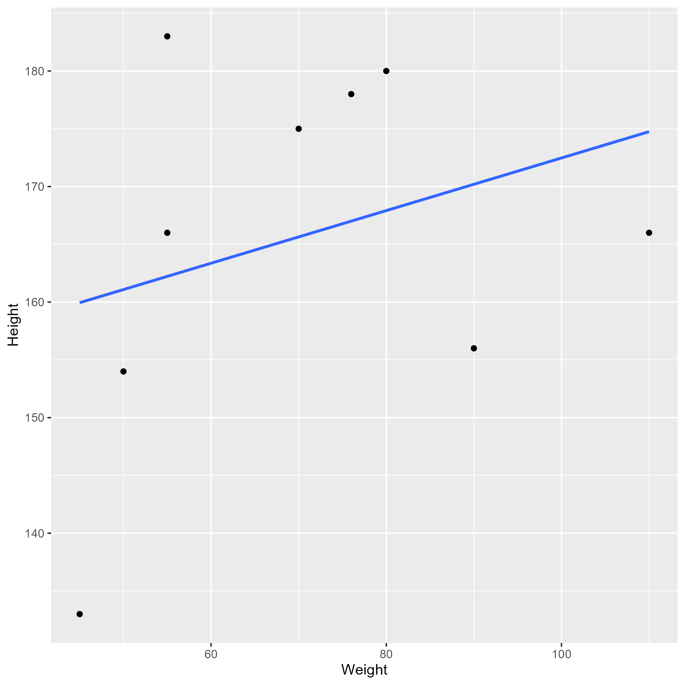

## Overview

-   A few simple slides using the [`revealjs` (html) format](https://quarto.org/docs/presentations/revealjs/).
-   For other formats (e.g. PowerPoint, or Beamer/pdf), see [here](https://quarto.org/docs/guide/).


## Figures and tables

This example pulls figures and tables directly from the project `results/` folder so the slides reflect the current generated outputs. For a final talk, you may instead copy selected results into `products/presentation/media/` if you want to freeze the exact presentation version.


## Example slide

This shows the summary table. It is pulled in from an RDS file and rendered as R chunk with the `kable` package. In general, we suggest more powerful/flexible table packages, such as `gt` or `flextable`, but for this example, `kable` is good enough.

Note that we could have loaded the data with `here()`, but if we ever want to copy this presentation to another folder outside the current project, you would have to adjust the path.

```{r}
#| label: tbl-summary-table
#| tbl-cap: "Data summary table."
#| echo: FALSE
resulttable <- readRDS("../../results/tables/summary-table.rds")
knitr::kable(resulttable)
```

## Example slide

This shows a figure created by the analysis script. It is inserted using Quarto/Markdown syntax (not knitr code, but that would be possible too).

{fig-align="center" width="420"}

## Example slide

This shows the model fitting results as table.

```{r}
#| label: tbl-result-table-2
#| tbl-cap: "Linear model fit table."
#| echo: FALSE
result_table_2 <- readRDS("../../results/tables/result-table-2.rds")
knitr::kable(result_table_2)
```

## Example slide with reference

This paper [@leek2015] discusses types of analyses.

## Further Resources

* [Quarto Presentation Documentation](https://quarto.org/docs/presentations/)
* [Slidecraft 101](https://emilhvitfeldt.com/project/slidecraft-101/) is a nice blog post showing some more advanced things one can do with Quarto slides.

## References
