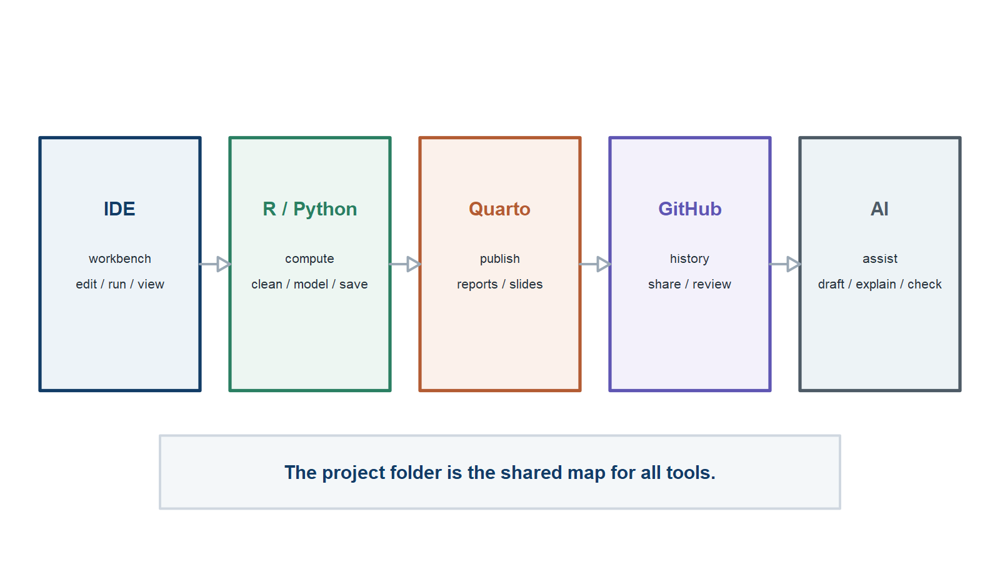
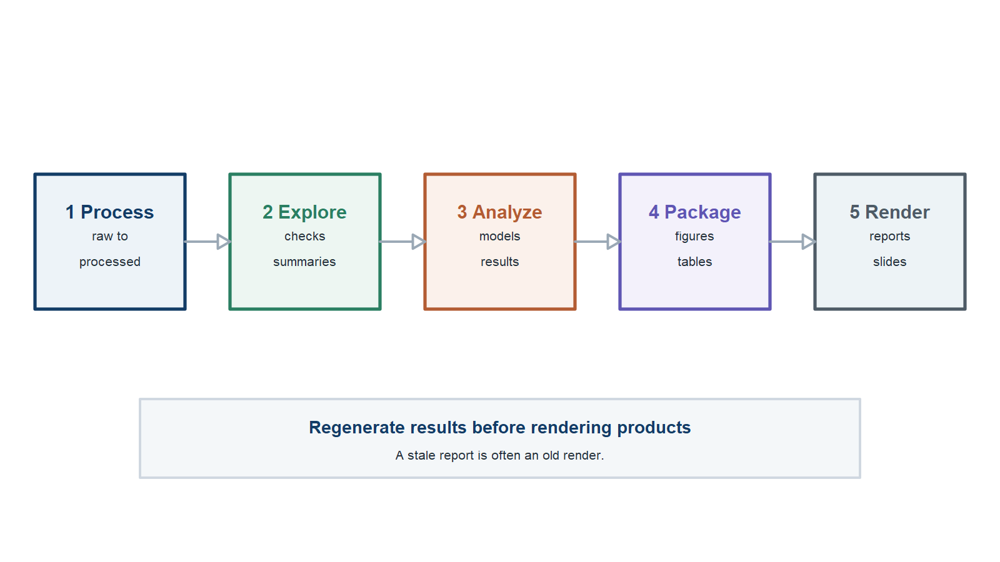
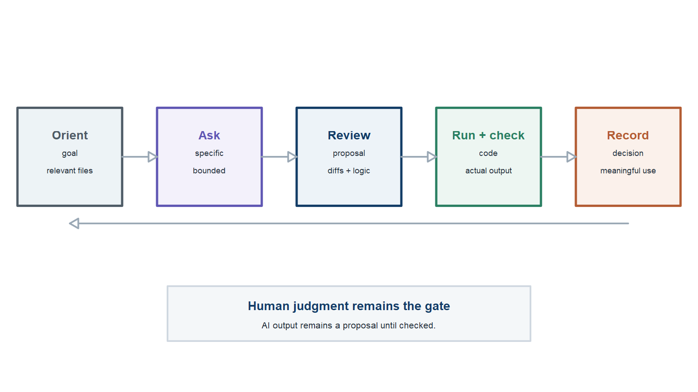

## Outline

::: {.outline-list}

1<strong>Why use a project template?</strong><small>Prevent drift and make reproducibility practical.</small>

2<strong>What tools are involved?</strong><small>Give each tool one clear job.</small>

3<strong>Where does everything go?</strong><small>Separate inputs, code, outputs, and products.</small>

4<strong>How do I get started?</strong><small>Set up, run, check, and document the workflow.</small>

5<strong>How should AI fit in?</strong><small>Use bounded assistance with human review.</small>

:::

::: {.notes}
Use this as a short roadmap, not a detailed agenda. The presentation answers two main questions: why a structured template helps, and how a new user can begin using it. The final section integrates AI practice, sharing, and next steps.

[Sources] Local template: readme.md; usage.md; new-project-instructions.md; ai/ai-use-policy.md.
:::

## Topic 1: Why the template exists {.section-break}

Topic 1

Why the template exists

Reproducible projects need structure before they need sophistication.

::: {.notes}
Begin with the practical problem. A template is useful because data-analysis projects accumulate files, tools, decisions, and outputs that otherwise drift apart.

[Sources] Local template: readme.md; usage.md. ORDERly framework supplied by the project author.
:::

## Small shortcuts create workflow problems

::: {.simple-list}

<strong>Copy-paste results</strong>Tables and figures lose their code trail.

<strong>Mystery files</strong>Nobody knows what is raw, derived, or current.

<strong>Invisible decisions</strong>Cleaning and modeling choices live in memory.

<strong>Unsafe sharing</strong>Private data slips into convenient places.

:::

::: {.notes}
Projects rarely fail at one dramatic step. More often, small shortcuts accumulate: a manually updated figure, a vaguely named file, an undocumented exclusion, or data placed in the wrong location. A shared workflow reduces these ordinary sources of confusion.

[Sources] Local template: readme.md; usage.md; data/readme-data.md; code-guidelines.md.
:::

## Put the project in ORDER

Organized + Recorded + Documented + Executable = Reproducible.

::: {.full-figure}

:::

::: {.notes}
ORDERly gives reproducibility a practical structure. Organized means people and tools can find the pieces. Recorded means changes and important decisions leave a useful trail. Documented means a new user can understand purpose, inputs, instructions, and outputs. Executable means the important path runs from saved instructions rather than remembered clicks. Reproducible is the testable outcome: a stated result can be recreated from the recorded inputs, instructions, and software.

[Sources] ORDERly framework supplied by the project author; local template: readme.md; usage.md; code-guidelines.md.
:::

## AI helps, but humans remain responsible

::: {.statement}
AI can accelerate coding, debugging, documentation, and review.

**Scientific judgment and final decisions remain human responsibilities.**
:::

::: {.notes}
AI belongs in the workflow, but it should not decide whether data are appropriate, whether a model is scientifically justified, whether private data can be shared, or what the final interpretation should be.

[Sources] Local template: ai/ai-use-policy.md; agents.md. MADA syllabus AI-use framing: https://andreashandel.github.io/MADAcourse/courseinfo/course-syllabus.html
:::

## The template keeps pieces connected

Data, code, outputs, products, AI help, and human decisions each have a defined place.

::: {.full-figure}

:::

::: {.notes}
The folder names are not valuable by themselves. The value comes from giving each part of the workflow a predictable place and preserving the path from source data to final communication. That structure also makes AI-assisted work easier to review.

[Sources] Local template: readme.md; usage.md; ai/ai-use-policy.md; agents.md.
:::
## Topic 2: The tools {.section-break}

Topic 2

The tools

No prior tool knowledge is required; each tool has one main job.

::: {.notes}
Define the tools from first principles. The goal is recognition and orientation, not mastery during this presentation.

[Sources] Local template: readme.md. MDS tools site: https://andreashandel.github.io/mds-tools/
:::

## Each tool has one main job

The project folder is the shared map that connects the tools.

::: {.full-figure}

:::

::: {.notes}
Walk left to right. The IDE is the workbench. R, Python, or Julia compute. Quarto publishes. Git and GitHub record and share change. AI assists with bounded tasks. The template gives all of these tools a common project structure.

[Sources] Local template: readme.md; usage.md. MDS tools overview: https://andreashandel.github.io/mds-tools/
:::

## Create, compute, and publish

::: {.simple-list .spacious}

<strong>IDE</strong>Edit files, run code, inspect output, and manage the project.

<strong>R, Python, or Julia</strong>Clean data, explore patterns, fit models, and save results.

<strong>Quarto</strong>Turn source files into reports, manuscripts, slides, and websites.

:::

::: {.notes}
An IDE is a workbench that combines a file browser, editor, console or terminal, output viewer, and Git tools. Positron is recommended in the template, but RStudio, VS Code, and other editors can support the same workflow. R is the default example language, not a restriction. Quarto reads a source file and renders a finished product that can be regenerated.

[Sources] Local template: readme.md; usage.md; code-guidelines.md. Positron introduction: https://andreashandel.github.io/mds-tools/courses/fc1-intro-positron/positron-introduction/positron-introduction.html. Quarto overview: https://andreashandel.github.io/mds-tools/courses/fc3-intro-quarto/quarto-introduction/quarto-introduction.html
:::

## Git records; GitHub shares

::: {.simple-list .spacious}

<strong>Git</strong>Records snapshots, compares changes, and lets you return to earlier versions.

<strong>GitHub</strong>Stores a remote repository and supports sharing, collaboration, and review.

<strong>Important limit</strong>A private repository is not approved secure storage for sensitive data.

:::

::: {.notes}
Define Git and GitHub separately. Git is version control on the project files. GitHub is a hosting and collaboration service. A private GitHub repository can limit access, but it is not a substitute for IRB-, DUA-, institutional-, or funder-approved secure storage.

[Sources] Local template: readme.md; new-project-instructions.md; data/readme-data.md. Git/GitHub in Positron: https://andreashandel.github.io/mds-tools/courses/fc4-intro-github/github-positron/github-positron.html
:::

## AI works best on reviewable tasks

::: {.simple-list .spacious}

<strong>Draft</strong>Code, comments, documentation, and report language.

<strong>Explain</strong>Errors, functions, workflow steps, and unfamiliar tools.

<strong>Review</strong>Paths, reproducibility gaps, stale documentation, and unclear outputs.

:::

::: {.notes}
Ask for bounded help: explain this error, review this function for path problems, draft a data check, or summarize what changed. Smaller requests are easier to evaluate. Reference managers, word processors, and TeX tools still matter, but they can be introduced when a particular product requires them.

[Sources] Local template: ai/ai-use-policy.md; agents.md; readme.md.
:::
## Topic 3: The repository map {.section-break}

Topic 3

The repository map

Each folder has a job, so people and tools can find the right material.

::: {.notes}
Explain the repository as a map with roles, not as a list of arbitrary folders.

[Sources] Local template: readme.md.
:::

## The main path is data to products

Support folders document, cite, and make AI assistance visible.

::: {.full-figure}

:::

::: {.notes}
Walk through the main path: data, code, results, and products. Then mention support material: assets for stable inputs and the ai folder for policy, project context, and meaningful AI-use records.

[Sources] Local template: readme.md; usage.md.
:::

## Keep raw and derived data separate

::: {.simple-list}

<strong>raw-data</strong>Original input; do not edit it by hand.

<strong>processed-data</strong>Cleaned or transformed data created by code.

<strong>private-data</strong>Restricted material that stays in an approved location.

<strong>large-files</strong>Files too large for ordinary Git and GitHub use.

:::

::: {.notes}
If a raw file is inconvenient, write code that creates a processed file. Do not fix raw spreadsheets by hand and lose the record of what changed. The data README should document source, sensitivity, access limits, and storage expectations.

[Sources] Local template: readme.md; usage.md; data/readme-data.md; agents.md.
:::

## Code follows the analysis stages

Each stage has recognizable inputs, outputs, and run instructions.

::: {.full-figure}

:::

::: {.notes}
Processing creates processed data. Exploration helps users understand and check the data. Modeling and analysis compute results. Figures and tables turn results into communication-ready artifacts. Utilities hold reusable helpers when needed.

[Sources] Local template: readme.md; usage.md; code/readme-code.md; code-guidelines.md.
:::

## Keep outputs and supporting inputs separate

::: {.simple-list}

<strong>results/</strong>Generated objects, figures, tables, and intermediate outputs.

<strong>products/</strong>Reports, manuscripts, slides, posters, and apps.

<strong>assets/</strong>References, CSL files, and manually created supporting material.

<strong>ai/</strong>AI policy, project summary, guidance, and meaningful-use log.

:::

::: {.notes}
Results should be generated by code and then consumed by products. Assets are stable supporting inputs rather than generated results. Documentation is part of the workflow: a technically runnable project is still difficult to reproduce if users cannot understand why, what, and how. Human-facing documentation remains authoritative if it conflicts with an AI summary.

[Sources] Local template: readme.md; usage.md; assets/readme-assets.md; ai/readme-ai.md; ai/ai-use-policy.md; agents.md.
:::
## Topic 4: Getting started {.section-break}

Topic 4

Getting started

Set identity and data rules first, then run and check the workflow.

::: {.notes}
This section turns the template into a short sequence a beginner can follow.

[Sources] Local template: new-project-instructions.md.
:::

## Start with identity and ground rules

::: {.steps-list}

1
<strong>Create from the template</strong> Start private unless sharing is already cleared.

2
<strong>Rename and describe the project</strong> Replace placeholders with real identity and purpose.

3
<strong>Classify the data</strong> Decide what can be committed and what stays elsewhere.

4
<strong>Document the software</strong> List the tools and packages needed to run the work.

:::

::: {.notes}
Many reproducibility problems begin because people jump into analysis before project identity, data sensitivity, and software expectations are documented. The default dependency approach is intentionally lightweight. Add environment managers, continuous integration, or containers only when project duration, collaboration, or risk justifies them.

[Sources] Local template: new-project-instructions.md; readme.md; data/readme-data.md; agents.md.
:::

## Run the workflow in clear stages

Regenerate results before rendering reports, manuscripts, or slides.

::: {.full-figure}

:::

::: {.notes}
The example workflow is semi-automated. The first three stages compute and save results. The figure and table scripts prepare final output artifacts. Products are rendered afterward. Users can understand and rerun individual stages without requiring one large pipeline tool.

[Sources] Local template: usage.md; code/readme-code.md.
:::

## Check the project before sharing

::: {.simple-list}

<strong>Raw data</strong>Was it left unchanged?

<strong>Outputs</strong>Can each important result be traced to code?

<strong>Privacy</strong>Were private and restricted files kept out?

<strong>Documentation</strong>Do the paths and instructions match the current project?

:::

::: {.notes}
Run these checks before accepting AI-assisted changes, sharing a repository, or making a project public. A clean-session or clean-copy run is a particularly useful way to expose hidden objects, absolute paths, missing packages, and undocumented manual steps.

[Sources] Local template: usage.md; agents.md; readme.md.
:::
## Topic 5: AI-assisted work and next steps {.section-break}

Topic 5

AI-assisted work and next steps

Use AI for bounded help, verify the result, and leave the project understandable.

::: {.notes}
The final section combines responsible AI practice with sharing and an immediate action plan.

[Sources] Local template: ai/ai-use-policy.md; ai/readme-ai.md; agents.md; new-project-instructions.md.
:::

## Give AI context; keep judgment human

::: {.simple-list}

<strong>Provide</strong>The goal, relevant files, task boundary, project guidance, and desired checks.

<strong>Request</strong>Small changes, clear explanations, testable outputs, and a summary of risks.

<strong>Retain</strong>Human ownership of scientific choices, privacy, citations, and interpretation.

:::

::: {.notes}
Point AI tools to the relevant project documentation instead of assuming they know the project. AI can suggest options, but scientific and governance decisions need human ownership. If a user cannot explain a proposed change, the task should be made smaller before it is accepted.

[Sources] Local template: readme.md; ai/ai-use-policy.md; agents.md; code-guidelines.md.
:::

## Use AI inside an ORDERly loop

Orient, ask, review, run and check, then record.

::: {.full-figure}

:::

::: {.notes}
First orient to the goal and inspect the relevant files. Ask for a bounded task with context and limits. Review the proposal. Run the affected code and inspect the actual output. Record meaningful assistance and the human decision. AI output remains a proposal until it has been checked.

[Sources] Local template: ai/ai-use-policy.md; ai/readme-ai.md; agents.md.
:::

## Protect sensitive information

::: {.statement}
Do not send private or restricted records to an AI tool unless that use is explicitly approved.

Use code structure, summaries, or synthetic examples when possible.
:::

::: {.notes}
The template policy says not to paste sensitive, private, regulated, unpublished, restricted, or identifiable data into external AI tools unless explicitly approved. Synthetic examples can preserve a useful data structure without exposing the original records.

[Sources] Local template: ai/ai-use-policy.md; data/readme-data.md. MADA synthetic data overview: https://andreashandel.github.io/MADAcourse/content/module-synthetic-data/synthetic-data-overview.html
:::

## A useful project is easy to continue

::: {.simple-list .spacious}

<strong>Future you</strong>History and documentation explain what happened.

<strong>Collaborators</strong>Commits and review make changes visible.

<strong>Wider sharing</strong>ORDERly structure lets others understand and rerun the work.

:::

::: {.notes}
Version control is useful for one person and becomes more important with collaborators. Public access alone does not create reproducibility. Sharing becomes useful when the project preserves organization, history, documentation, executable instructions, and a testable result.

[Sources] Local template: readme.md; usage.md; new-project-instructions.md.
:::

## A useful first-week plan

::: {.steps-list .compact}

1
<strong>Create and rename</strong> Establish project identity and authorship.

2
<strong>Classify data</strong> Separate commit-safe, private, large, and restricted files.

3
<strong>Adapt the workflow</strong> Connect scripts, inputs, outputs, and run order.

4
<strong>Run and render</strong> Regenerate outputs, then update products.

5
<strong>Commit a checkpoint</strong> Preserve one small, reviewed, working state.

:::

::: {.notes}
The first week does not need to solve the science. It should make the project understandable, runnable, and safe to share within the intended team.

[Sources] Local template: new-project-instructions.md; usage.md; readme.md.
:::

## Where to learn more

::: {.resource-list}

<strong>MDS project template</strong><a href="https://github.com/andreashandel/mds-project-template">github.com/andreashandel/mds-project-template</a>

<strong>MDS tools mini-courses</strong><a href="https://andreashandel.github.io/mds-tools/">andreashandel.github.io/mds-tools</a>

<strong>Inside the template</strong><code>readme.md</code>, <code>usage.md</code>, <code>new-project-instructions.md</code>, <code>code-guidelines.md</code>, <code>agents.md</code>, and <code>ai/ai-use-policy.md</code>

:::

::: {.notes}
End by pointing people to the repository documentation and the tool mini-courses they need. The deck is an introduction; the next step is to create a small project and use the documentation while working through the first setup and run.

[Sources] MDS project template: https://github.com/andreashandel/mds-project-template. MDS tools site: https://andreashandel.github.io/mds-tools/. Local template documents listed on the slide.
:::
