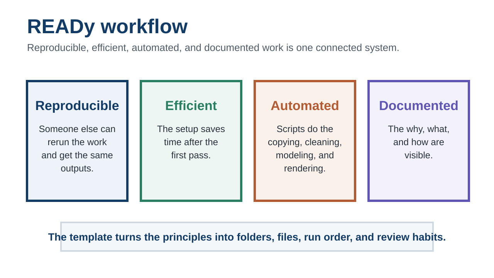
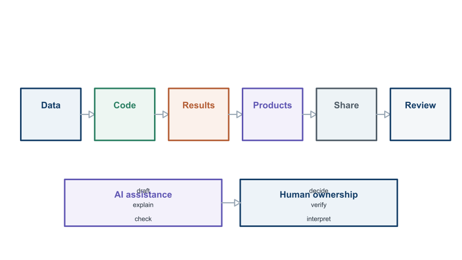
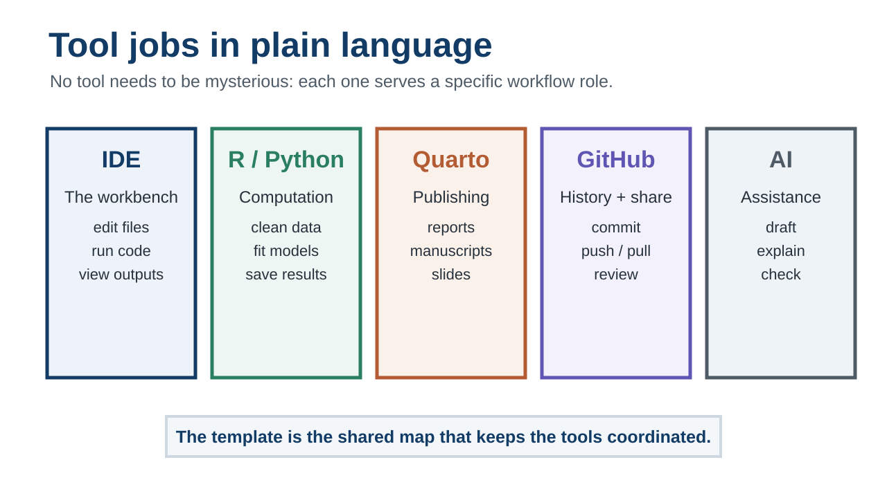
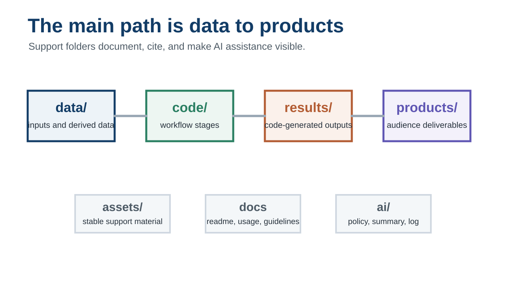
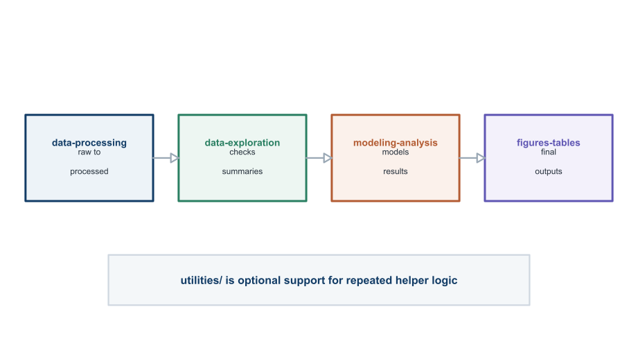
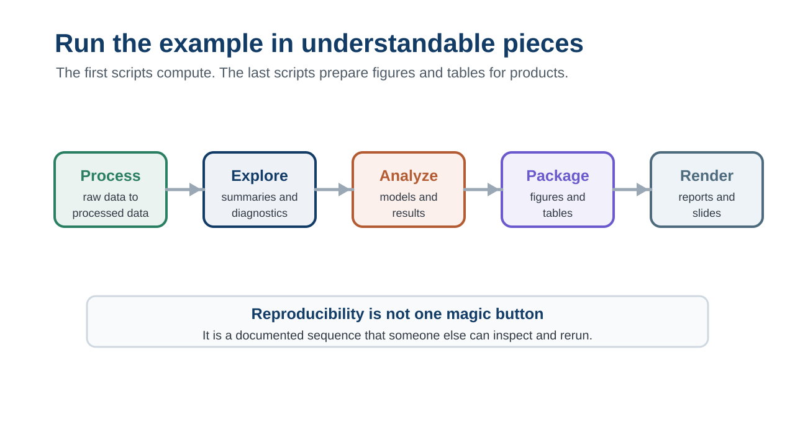
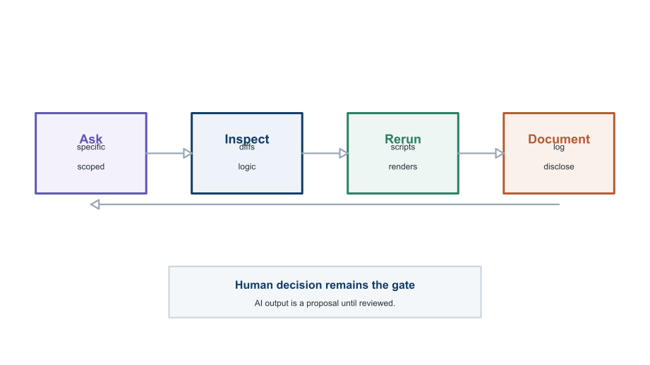

## Outline

::: {.outline-list}

1<strong>Why the template exists</strong> Motivation, READy workflows, and AI responsibility.

2<strong>The tools</strong> What each tool does, assuming no prior experience.

3<strong>The repository map</strong> Where data, code, results, products, assets, and AI notes belong.

4<strong>Getting started</strong> First setup decisions and the example run order.

5<strong>AI-assisted work</strong> How to use AI help without losing review and ownership.

6<strong>Sharing and next steps</strong> Collaboration, open research, and learning resources.

:::

::: {.notes}
Use this as the roadmap for the talk. The main arc is: first motivate why a workflow template is needed, then introduce the tools, then explain the repository, then show how to start, then discuss responsible AI use and sharing.

[Sources] Local template: readme.md; usage.md; new-project-instructions.md; ai/ai-use-policy.md.
:::

## Topic 1: Why the template exists {.section-break}

Topic 1

Why the template exists

Reproducible projects need structure before they need sophistication.

::: {.notes}
This section motivates the template before introducing folders or tools. The point is to make the audience care about project drift, READy workflows, and human responsibility in AI-assisted analysis.

[Sources] Local template: readme.md; usage.md. READy workflow framing: https://andreashandel.github.io/MADAcourse/content/module-ready-workflow/ready-overview.html
:::

## Analysis projects rarely fail at one dramatic step

::: {.headline}
They usually drift: files move, outputs age, decisions vanish, and nobody knows which result is current.
:::

::: {.notes}
Start with a practical motivation rather than the folder structure. A data analysis project is not only a statistical model or a script. It is a collection of data, code, results, products, decisions, people, and software. The template exists because those pieces tend to drift apart unless the workflow keeps them connected.

[Sources] Local template: readme.md; usage.md. READy workflow framing: https://andreashandel.github.io/MADAcourse/content/module-ready-workflow/ready-overview.html
:::

## The common failure modes are ordinary

:::: {.four-up}
::: {.tile .accent-green}
**Copy-paste results**

Tables and figures lose their code trail.
:::
::: {.tile .accent-blue}
**Mystery files**

Nobody knows what is raw, derived, or final.
:::
::: {.tile .accent-orange}
**Invisible decisions**

Cleaning and modeling choices live in memory.
:::
::: {.tile .accent-purple}
**Unsafe sharing**

Private data slips into convenient places.
:::
::::

::: {.notes}
These are not exotic problems. They are the normal consequences of using separate tools without a shared project system. Use this slide to connect reproducibility to day-to-day work: fewer stale outputs, fewer unclear files, and less risk when sharing.

[Sources] Local template: readme.md; usage.md; data/readme-data.md; code-guidelines.md. READy introduction: https://andreashandel.github.io/MADAcourse/content/module-ready-workflow/ready-introduction/ready-introduction.html
:::

## READy is the workflow target

Reproducible, efficient, automated, and documented work is one connected system.

::: {.full-figure}

:::

::: {.notes}
READy stands for reproducible, efficient, automated, and documented. The MADA course frames these as connected ideas: reproducibility requires documentation and automation, and automation also improves efficiency. The template turns that teaching concept into a concrete repository layout.

[Sources] READy overview: https://andreashandel.github.io/MADAcourse/content/module-ready-workflow/ready-overview.html. READy introduction: https://andreashandel.github.io/MADAcourse/content/module-ready-workflow/ready-introduction/ready-introduction.html
:::

## AI changes the workflow, but not the responsibility

::: {.statement}
AI can accelerate coding, debugging, documentation, and review.

**It does not own the scientific judgment.**
:::

::: {.notes}
Use this slide to set the tone for AI use. AI belongs in the workflow, but it should not decide whether data are appropriate, whether a model is scientifically justified, whether private data can be shared, or what the final interpretation should be.

[Sources] Local template: ai/ai-use-policy.md; agents.md. MADA syllabus AI-use framing: https://andreashandel.github.io/MADAcourse/courseinfo/course-syllabus.html
:::

## The template is a practical answer

Data, code, outputs, products, AI help, and human decisions each have a defined place.

::: {.full-figure}

:::

::: {.notes}
This is the first explicit template slide. The point is not that the folder names are special by themselves. The point is that the repository gives each part of the workflow a defined place and makes AI-assisted work reviewable.

[Sources] Local template: readme.md; usage.md; ai/ai-use-policy.md; agents.md.
:::

## By the end, users should know three things

:::: {.three-up .large-tiles}
::: {.tile .accent-blue}
**What problem this solves**

Keeping data, code, outputs, products, and decisions connected.
:::
::: {.tile .accent-green}
**What each tool does**

Enough vocabulary to start, even without prior tool experience.
:::
::: {.tile .accent-orange}
**How to begin**

A concrete first pass from template repository to checked workflow.
:::
::::

::: {.notes}
This replaces a generic agenda. It defines the audience outcome. The deck is meant for oral presentation, so visible copy stays short and the explanatory detail is in the notes.

[Sources] Local template: readme.md; new-project-instructions.md; usage.md.
:::

## Topic 2: The tools {.section-break}

Topic 2

The tools

Assume no prior tool knowledge; give each tool one clear job.

::: {.notes}
Transition to a beginner-friendly tool section. Avoid treating R, Quarto, Git, GitHub, or an IDE as self-explanatory.

[Sources] Local template: readme.md. MDS tools site: https://andreashandel.github.io/mds-tools/
:::

## Each tool has one main job

No tool needs to be mysterious: each one serves a specific workflow role.

::: {.full-figure}

:::

::: {.notes}
Walk left to right. The IDE is the workbench. R, Python, or Julia compute. Quarto publishes. Git records history. GitHub backs up and shares. AI assists, explains, drafts, and reviews. The template gives these tools a common project structure.

[Sources] Local template: readme.md; usage.md. MDS tools overview: https://andreashandel.github.io/mds-tools/. Positron intro: https://andreashandel.github.io/mds-tools/courses/fc1-intro-positron/positron-introduction/positron-introduction.html. Quarto overview: https://andreashandel.github.io/mds-tools/courses/fc3-intro-quarto/quarto-introduction/quarto-introduction.html. Git in Positron: https://andreashandel.github.io/mds-tools/courses/fc4-intro-github/github-positron/github-positron.html
:::

## The IDE is the workbench

:::: {.split}
::: {.left}
**What it is**

A single place to edit files, run code, inspect output, and manage the project.
:::
::: {.right .big-list}
- File browser
- Code editor
- Console and terminal
- Viewer for plots and rendered documents
- Git panel
:::
::::

::: {.notes}
For beginners, define IDE before naming Positron. Positron is recommended in the local template because it works well with R, Quarto, Python, Julia, and Git/GitHub, but the same project ideas can work in RStudio, VS Code, or another editor.

[Sources] Local template: readme.md; usage.md. Positron introduction: https://andreashandel.github.io/mds-tools/courses/fc1-intro-positron/positron-introduction/positron-introduction.html. Positron features: https://andreashandel.github.io/mds-tools/courses/fc1-intro-positron/positron-features/positron-features.html
:::

## R is the default computation language

:::: {.split}
::: {.left .big-list}
- Read and clean data
- Explore patterns
- Fit models
- Save result objects
- Create figures and tables
:::
::: {.right}
**Important distinction**

The template is workflow-first. R is the example; Python, Julia, and shell scripts can be added when a project needs them.
:::
::::

::: {.notes}
Do not assume the audience knows what R is. R is a programming language widely used for statistical computing and data analysis. The example uses R, but the repository structure is not R-only. Scripts from other languages should still live in the workflow stage where they belong.

[Sources] Local template: readme.md; usage.md; code-guidelines.md.
:::

## Quarto turns source into products

:::: {.split}
::: {.left}
**A `.qmd` file can combine**

- YAML settings
- Markdown text
- Code chunks
- Figures, tables, and citations
:::
::: {.right}
**Rendered outputs can be**

- HTML reports
- Word manuscripts
- PDF supplements
- Reveal.js slides
- Websites
:::
::::

::: {.notes}
Quarto is an open-source scientific and technical publishing system. Explain rendering: Quarto reads a source file and produces a finished output. This matters because products can be regenerated instead of manually rebuilt.

[Sources] Local template: readme.md; usage.md; products/presentation/example/presentation.qmd. Quarto overview: https://andreashandel.github.io/mds-tools/courses/fc3-intro-quarto/quarto-introduction/quarto-introduction.html
:::

## Git records change over time

:::: {.split}
::: {.left}
**Git answers:**

- What changed?
- When did it change?
- Who changed it?
- Can we go back?
:::
::: {.right}
**GitHub adds:**

- Remote backup
- Sharing
- Collaboration
- Pull requests
:::
::::

::: {.notes}
Define Git and GitHub separately. Git is version control on the project files. GitHub is a hosting and collaboration service. The template assumes Git/GitHub because history and review are central to reproducible work.

[Sources] Local template: readme.md; new-project-instructions.md. Git/GitHub in Positron: https://andreashandel.github.io/mds-tools/courses/fc4-intro-github/github-positron/github-positron.html
:::

## GitHub is useful, but not a data vault

::: {.statement .warning}
A private GitHub repository is not the same as approved secure storage.
:::

::: {.notes}
This should be emphasized for any real data project. GitHub is useful for version control and collaboration, but private repositories are not a substitute for IRB-, DUA-, institutional-, or funder-approved secure storage. Sensitive or restricted data should usually remain outside the repository in documented local or approved locations.

[Sources] Local template: readme.md; new-project-instructions.md; data/readme-data.md.
:::

## AI tools are useful when the task is reviewable

:::: {.three-up}
::: {.tile .accent-purple}
**Draft**

Code, comments, documentation, report language.
:::
::: {.tile .accent-green}
**Explain**

Errors, functions, workflow steps, unfamiliar tools.
:::
::: {.tile .accent-orange}
**Review**

Paths, reproducibility gaps, stale docs, unclear outputs.
:::
::::

::: {.notes}
This is a practical AI slide. Ask for bounded help: explain this error, review this function for path problems, draft a data check, summarize what changed. The smaller the request, the easier it is to review.

[Sources] Local template: ai/ai-use-policy.md; agents.md; readme.md.
:::

## Reference and writing tools still matter

:::: {.three-up}
::: {.tile .accent-blue}
**Zotero + BibTeX**

Keeps citations usable in Quarto.
:::
::: {.tile .accent-green}
**Word or LibreOffice**

Opens rendered manuscript files.
:::
::: {.tile .accent-orange}
**TinyTeX**

Needed for many PDF outputs.
:::
::::

::: {.notes}
The template is not just code. Real projects need references, manuscripts, reports, and PDFs. The local README recommends a reference manager that handles BibTeX, plus Word or LibreOffice for DOCX and a TeX distribution such as TinyTeX for PDF output.

[Sources] Local template: readme.md; usage.md.
:::

## Topic 3: The repository map {.section-break}

Topic 3

The repository map

Each folder has a job, and the jobs keep the workflow traceable.

::: {.notes}
Transition from tools to structure. The next slides explain the repository as a map with roles, not as a list of arbitrary folders.

[Sources] Local template: readme.md.
:::

## The main path is data to products

Support folders document, cite, and make AI assistance visible.

::: {.full-figure}

:::

::: {.notes}
This figure should be large enough to read from the back of a room. Walk through the path: data, code, results, products. Then mention the support folders: assets for stable supporting material and ai for AI policy, summary, and logs.

[Sources] Local template: readme.md; usage.md.
:::

## `data/` is not one bucket

:::: {.four-up}
::: {.tile .accent-blue}
**raw-data**

Original input; do not edit by hand.
:::
::: {.tile .accent-green}
**processed-data**

Derived by scripts.
:::
::: {.tile .accent-purple}
**private-data**

Local or restricted.
:::
::: {.tile .accent-orange}
**large-files**

Too large for ordinary Git/GitHub use.
:::
::::

::: {.notes}
Stress the raw-data rule. If the raw file is inconvenient, write code that creates a processed file. Do not fix raw Excel files by hand and lose the record of what changed.

[Sources] Local template: readme.md; usage.md; data/readme-data.md; agents.md.
:::

## `code/` follows the analysis stages

Each stage should have clear inputs, outputs, and run instructions.

::: {.full-figure}

:::

::: {.notes}
The code folders mirror the project workflow. Processing creates processed data. Exploration helps understand the data. Modeling/analysis computes results. Figures/tables turns results into communication-ready artifacts. Utilities hold reusable helpers when needed.

[Sources] Local template: readme.md; usage.md; code/readme-code.md; code-guidelines.md.
:::

## `results/` and `products/` are different

:::: {.split}
::: {.left}
**Results**

Generated objects, figures, tables, and intermediate outputs.
:::
::: {.right}
**Products**

Reports, manuscripts, slides, posters, apps, and other deliverables.
:::
::::

::: {.notes}
This distinction prevents a common reproducibility problem. Results should be generated by code and then consumed by products. Products are what an audience sees. If a figure is manually created, it belongs in assets, not results, unless the manual source is documented and intentionally treated as a static input.

[Sources] Local template: readme.md; usage.md; agents.md.
:::

## `assets/` and `ai/` support the workflow

:::: {.split}
::: {.left}
**`assets/`**

References, CSL files, manually created schematics, and stable supporting material.
:::
::: {.right}
**`ai/`**

Policy, project summary, AI-use log, and AI guidance.
:::
::::

::: {.notes}
Assets are stable supporting inputs, not generated outputs. The AI folder makes assistance transparent and gives AI tools a short project summary, but human-facing documentation remains authoritative.

[Sources] Local template: readme.md; assets/readme-assets.md; ai/readme-ai.md; ai/ai-use-policy.md; agents.md.
:::

## Documentation is part of the product

::: {.statement}
If users cannot understand why, what, and how, technical reproducibility is not enough.
:::

::: {.notes}
The MADA documentation unit makes this point directly: documentation is essential for practical reproducibility. Running code is not enough if a collaborator cannot understand the project. The template therefore includes project-level and folder-level readmes plus usage instructions.

[Sources] Local template: readme.md; usage.md; code-guidelines.md. Project documentation unit: https://andreashandel.github.io/MADAcourse/content/module-ready-workflow/ready-documentation/ready-documentation.html
:::

## Topic 4: Getting started {.section-break}

Topic 4

Getting started

Start with identity, data rules, software notes, and a documented run order.

::: {.notes}
Transition to the getting-started sequence. This is deliberately practical and beginner-friendly.

[Sources] Local template: new-project-instructions.md.
:::

## The first setup pass is not analysis

::: {.numbered-flow}

1<strong>Create from the template</strong> Start private unless sharing is already cleared.

2<strong>Rename the project</strong> Replace template placeholders with real project identity.

3<strong>Document data policy</strong> Decide what can be committed and what stays local.

4<strong>Update software notes</strong> List packages and tools users need.

:::

::: {.notes}
This slide makes the first setup pass concrete. Many reproducibility problems begin because people jump straight into analysis before project identity, data sensitivity, and software expectations are documented.

[Sources] Local template: new-project-instructions.md; readme.md; data/readme-data.md.
:::

## The example workflow runs in pieces

Compute results first; render reports and slides after outputs are current.

::: {.full-figure}

:::

::: {.notes}
The example workflow is semi-automated: code is reproducible, but users can run understandable stages manually. The first three stages compute and save results. The figures/tables scripts prepare final output artifacts. Products are rendered afterward.

[Sources] Local template: usage.md; code/readme-code.md.
:::

## Reproducibility checks happen before sharing

:::: {.four-up}
::: {.tile .accent-blue}
**Raw data**

Was it left unchanged?
:::
::: {.tile .accent-green}
**Outputs**

Can each be traced to code?
:::
::: {.tile .accent-orange}
**Privacy**

Were private files kept out?
:::
::: {.tile .accent-purple}
**Docs**

Do instructions match reality?
:::
::::

::: {.notes}
This checklist comes from `usage.md` and `agents.md`. It is especially important before accepting AI-assisted changes, sharing a repository, or making a project public.

[Sources] Local template: usage.md; agents.md; readme.md.
:::

## Software management can grow with the project

::: {.numbered-flow .compact}

1<strong>Manual package list</strong> Default, easiest for small projects.

2<strong>Environment manager</strong> Use when exact versions matter.

3<strong>CI or container</strong> Use when controlled reruns matter across machines.

:::

::: {.notes}
Do not introduce heavy infrastructure before it is needed. The local template intentionally starts with manual package documentation. For longer-term, multi-user, publication, or regulated workflows, environment managers, CI, or containers may become appropriate.

[Sources] Local template: readme.md; agents.md. Software management unit: https://andreashandel.github.io/MADAcourse/content/module-ready-workflow/ready-software-management/ready-software-management.html
:::

## Topic 5: AI-assisted work {.section-break}

Topic 5

AI-assisted work

Use AI for bounded help, then inspect, rerun, and document.

::: {.notes}
This section shifts from general project setup to AI operating practice. The audience should leave with a concrete loop for asking, checking, rerunning, and documenting meaningful AI help.

[Sources] Local template: ai/ai-use-policy.md; ai/readme-ai.md; agents.md.
:::

## AI assistance needs context

:::: {.split}
::: {.left}
**Give AI**

- The specific file
- The task boundary
- The relevant docs
- The desired checks
:::
::: {.right}
**Ask for**

- Small changes
- Clear explanations
- Testable outputs
- A summary of risks
:::
::::

::: {.notes}
This slide turns the AI policy into a usable practice. The local README tells users to point AI tools to the project documentation, including readme, usage, agents, code guidelines, data readme, and AI files.

[Sources] Local template: readme.md; ai/ai-use-policy.md; agents.md.
:::

## Some decisions should not be delegated

:::: {.two-up}
::: {.tile .accent-orange}
**Scientific judgment**

Question, data suitability, assumptions, interpretation.
:::
::: {.tile .accent-purple}
**Governance judgment**

Privacy, sharing permission, citation accuracy, disclosure.
:::
::::

::: {.notes}
AI can suggest options, but these decisions need human ownership and review. This is especially important when the deck is presented to new users who may be tempted to treat AI output as authoritative.

[Sources] Local template: ai/ai-use-policy.md; code-guidelines.md.
:::

## AI belongs inside the review loop

The loop makes assistance visible, bounded, and checkable.

::: {.full-figure}

:::

::: {.notes}
Use the loop to make AI work operational: ask a bounded question, inspect changes, rerun affected outputs, document meaningful use, then decide. For real projects, the AI-use log provides transparency unless the project owner disables it.

[Sources] Local template: ai/ai-use-policy.md; ai/readme-ai.md; agents.md.
:::

## Synthetic data can help protect privacy

::: {.statement}
When sensitive raw records cannot be shared with AI, use code structure, summaries, or synthetic examples instead.
:::

::: {.notes}
The template policy says not to paste sensitive, private, regulated, unpublished, restricted, or identifiable data into external AI tools unless explicitly approved. The MADA course also includes synthetic-data material as a way to work safely with data-like structures.

[Sources] Local template: ai/ai-use-policy.md; data/readme-data.md. MADA synthetic data overview: https://andreashandel.github.io/MADAcourse/content/module-synthetic-data/synthetic-data-overview.html
:::

## Topic 6: Sharing and next steps {.section-break}

Topic 6

Sharing and next steps

A project is ready to share when others can understand and rerun it.

::: {.notes}
This final section connects the template to collaboration, open research, a practical first-week plan, and follow-up learning resources.

[Sources] Local template: readme.md; usage.md; new-project-instructions.md. Open research unit: https://andreashandel.github.io/MADAcourse/content/module-ready-workflow/ready-open/ready-open.html
:::

## The template also supports collaboration

:::: {.split}
::: {.left}
**Solo use**

History helps future you understand what happened.
:::
::: {.right}
**Team use**

Commits, branches, and pull requests make review explicit.
:::
::::

::: {.notes}
Project management here means management of actual files and folders. Version control is useful for one person and becomes more important with collaborators because it records who did what and reduces confusion.

[Sources] Local template: readme.md; new-project-instructions.md. Project management unit: https://andreashandel.github.io/MADAcourse/content/module-ready-workflow/ready-project-management/ready-project-management.html
:::

## Open research needs READy structure

::: {.statement}
Sharing data and code is useful only when others can understand and rerun the workflow.
:::

::: {.notes}
READy workflows and open research are related but not identical. The open-science material makes the point that sharing data and code is much less useful if the workflow is not documented and reproducible.

[Sources] Open research unit: https://andreashandel.github.io/MADAcourse/content/module-ready-workflow/ready-open/ready-open.html. Local template: readme.md; usage.md.
:::

## A useful first-week plan

::: {.numbered-flow .compact}

1<strong>Create and rename</strong> Project identity and authorship.

2<strong>Classify data</strong> Commit-safe, private, large, restricted.

3<strong>Adapt workflow</strong> Scripts, inputs, outputs, run order.

4<strong>Run and render</strong> Regenerate outputs, then products.

5<strong>Commit checkpoint</strong> Small reviewed history point.

:::

::: {.notes}
Close with an action plan rather than another conceptual summary. The first week does not need to solve the science. It should make the project understandable, runnable, and safe to share within the intended team.

[Sources] Local template: new-project-instructions.md; usage.md; readme.md.
:::

## Where to learn more

:::: {.resource-grid}
::: {.resource}
**READy workflow module**

<https://andreashandel.github.io/MADAcourse/content/module-ready-workflow/ready-overview.html>
:::
::: {.resource}
**MDS tools mini-courses**

<https://andreashandel.github.io/mds-tools/>
:::
::: {.resource}
**Inside this template**

`readme.md`, `usage.md`, `new-project-instructions.md`, `code-guidelines.md`, `agents.md`, and `ai/ai-use-policy.md`
:::
::::

::: {.notes}
End by pointing people to the internal and external resources. The deck itself is an entry point; users should next read the repository documentation and the tool mini-courses they need.

[Sources] READy module: https://andreashandel.github.io/MADAcourse/content/module-ready-workflow/ready-overview.html. MDS tools site: https://andreashandel.github.io/mds-tools/. Local template docs listed on slide.
:::
