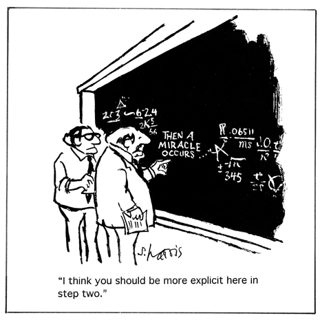
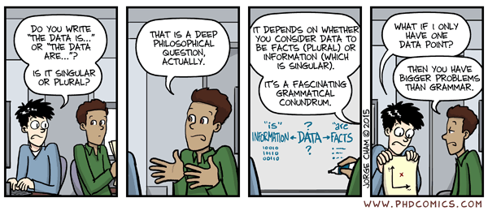
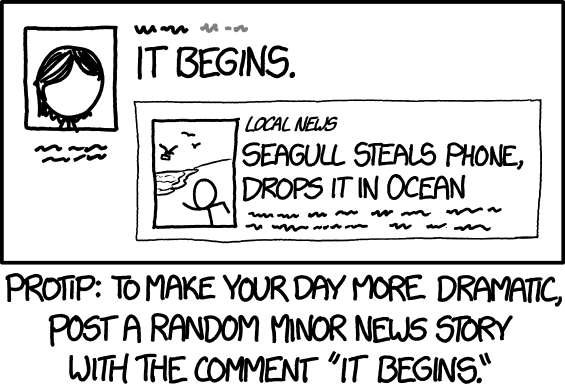

## Overview

::: {.arc-list}

<strong>Concept</strong> Organized, reproducible, and AI-ready projects

<strong>Implementation</strong> A setup/template that turns those ideas into a practical working environment

<strong>Hands-on</strong> Using the setup to start and implement your own project

:::

## Concept {.section-break}

Part 1

Concepts of reproducible, AI-assisted project workflows

## Motivation

::: {.motivation-layout}

<ul>
<li>Reproducibility is a hallmark of good science</li>
<li>A well-organized, reproducible project often makes work more efficient</li>
<li>AI-supported work is the <del>future</del> present</li>
</ul>

::: {.xkcd-figure}
{fig-alt="An XKCD comic about reproducibility and the replication crisis."}
:::
:::

::: {.notes}
[Sources] Image file: media/xkcd-replication-crisis.png.
:::

## Problems with "standard" workflows

::: {.problems-layout}
::: {.simple-list}

<strong>Results drift from their code</strong>Copied tables and figures become hard to update or verify

<strong>Files lose their roles</strong>Raw, processed, current, and obsolete versions become difficult to distinguish

<strong>Decisions disappear</strong>Cleaning and modeling choices remain in memory or private conversations

<strong>Sharing becomes risky</strong>Private data and unfinished material move into unsuitable places

<strong>Reproducibility is hard</strong>Others (including your future self) will struggle reproducing your work

:::

::: {.problem-figure}
{fig-alt="A black-and-white cartoon showing an unexplained step labeled 'Then a miracle occurs' in a mathematical derivation."}
:::
:::

::: {.notes}
[Sources] Cartoon supplied by the project owner: media/amiracleoccurs.gif.
:::

## The ORDERly concept

<strong>O</strong>rganized + <strong>R</strong>ecorded + <strong>D</strong>ocumented + <strong>E</strong>xecutable = <strong>R</strong>eproducible (<strong>ORDER</strong>ly)

::: {.flow-figure .orderly-flow}

<strong>Organized</strong>predictable places

+

<strong>Recorded</strong>changes and decisions

+

<strong>Documented</strong>purpose and instructions

+

<strong>Executable</strong>saved steps that run

↓

<strong>Reproducible</strong>a stated result can be recreated

:::

## ORDERly AI work

<strong>O</strong>rganized + <strong>R</strong>estricted + <strong>D</strong>ocumented + <strong>E</strong>valuated = <strong>R</strong>eproducible AI support

::: {.flow-figure .ai-flow}

<strong>Organized</strong>clear project context

+

<strong>Restricted</strong>privacy and scope limits

+

<strong>Documented</strong>instructions and logs

+

<strong>Evaluated</strong>checks before acceptance

↓

<strong>Reproducible</strong>bounded, inspectable, and project-owned

:::

::: {.notes}
AI can support judgment but cannot transfer accountability. Never send private or restricted material to an AI tool unless that use is explicitly approved.

[Sources] Local template: ai/ai-use-policy.md; data/readme-data.md; agents.md.
:::

## Implementation {.section-break}

Part 2

Implementation

A setup to support an AI-assisted ORDERly workflow

## An ORDERly project setup

The setup combines template structure, text-based tools, version tracking, AI guardrails, and a reproducible workflow

::: {.orderly-map}

<strong>Organized</strong>The template repository gives <code>data/</code>, <code>code/</code>, <code>results/</code>, <code>products/</code>, <code>assets/</code>, and <code>ai/</code> distinct roles

<strong>Recorded</strong>Git/GitHub history, generated outputs, AI-use logs, and project notes preserve the path taken

<strong>Documented</strong>Markdown, YAML, Quarto files, folder READMEs, and AI policy explain what to do and why

<strong>Executable</strong>Scripts and Quarto files regenerate processed data, analyses, figures, tables, and products

<strong>Reproducible</strong>An accepted result can be traced from input data through code to final communication

:::

## Specific tools (largely interchangeable)

::: {.tool-matrix}

<strong>Editor/IDE</strong><b>Positron</b>, VS Code, RStudio, JupyterLab

<strong>Coding language</strong><b>R</b>, Python, Julia

<strong>Authoring</strong><b>Quarto</b>, Typst, R Markdown, Jupyter Book

<strong>Tracking</strong><b>Git/GitHub</b>, GitLab, Bitbucket

<strong>Agentic AI</strong><b>ChatGPT Codex</b>, Claude Code, Gemini CLI

<strong>Workflow management (optional)</strong>renv, targets, Docker, Conda, Make

:::

## The project structure gives each part a role

The main path moves through data, code, results, and products; support folders provide stable inputs and guidance

::: {.flow-figure .repository-flow}

<strong>data/</strong>inputs derived data

→

<strong>code/</strong>workflow stages

→

<strong>results/</strong>generated outputs

→

<strong>products/</strong>deliverables for audience

<strong>assets/</strong>stable support

<strong>docs</strong>readme usage

<strong>ai/</strong>policy summary log

:::

::: {.work-tree-strip}
work tree<code>data/</code><code>code/</code><code>results/</code><code>products/</code><code>assets/</code><code>ai/</code><code>readme.md</code><code>usage.md</code>
:::

::: {.notes}
Walk through the main path first. Then add assets for supporting materials and ai for policy, context, guidance, and meaningful-use records.

[Sources] Local template: readme.md; usage.md.
:::

## Separate raw, derived, private, and large data

::: {.data-layout}
::: {.simple-list}

<strong>raw-data/</strong>Original input; preserve it unchanged

<strong>processed-data/</strong>Cleaned or transformed data generated by code

<strong>private-data/</strong>Restricted material kept in an approved location

<strong>large-files/</strong>Material too large for ordinary Git and GitHub use

:::

::: {.data-figure}
{fig-alt="A PhD Comics cartoon about data being rare."}
:::
:::

::: {.work-tree-strip}
work tree<code>data/raw-data/</code><code>data/processed-data/</code><code>data/private-data/</code><code>data/large-files/</code><code>data/readme-data.md</code>
:::

::: {.notes}
If raw data are inconvenient, write code that produces a processed version. The data README should document source, sensitivity, access limits, and AI inspection rules.

[Sources] Local template: data/readme-data.md; readme.md; usage.md; agents.md. Cartoon supplied by the project owner: media/phd_dataisorare.gif.
:::

## Code follows the stages of the analysis

Each stage should have recognizable inputs, outputs, and instructions

::: {.flow-figure .code-flow}

<strong>data-processing</strong>raw to processed

→

<strong>data-exploration</strong>checks summaries

→

<strong>modeling-analysis</strong>models results

→

<strong>figures-tables</strong>final outputs

<strong>utilities/</strong>is optional support for repeated helper logic

:::

::: {.work-tree-strip}
work tree<code>code/data-processing/</code><code>code/data-exploration/</code><code>code/modeling-analysis/</code><code>code/figures-tables/</code><code>code/utilities/</code>
:::

::: {.notes}
Processing creates processed data. Exploration checks it. Modeling and analysis compute results. Figures and tables prepare communication-ready artifacts. Utilities hold reusable helpers.

[Sources] Local template: usage.md; code/readme-code.md; code-guidelines.md.
:::

## Keep generated outputs separate from supporting inputs

::: {.simple-list}

<strong>results/</strong>Code-generated model objects, intermediate outputs, figures, and tables

<strong>products/</strong>Reports, manuscripts, supplements, presentations, posters, and apps

<strong>assets/</strong>References, PDFs, schematics, and other stable supporting material

<strong>ai/</strong>AI policy, project context, guidance, and meaningful-use records

:::

::: {.work-tree-strip}
work tree<code>results/figures/</code><code>results/tables/</code><code>results/output/</code><code>products/report/</code><code>products/manuscript/</code><code>products/presentation/</code><code>assets/</code><code>ai/</code>
:::

## A modular, staged workflow

::: {.run-sequence}

1<strong>Process</strong><small>raw → processed</small>

2<strong>Explore</strong><small>checks + summaries</small>

3<strong>Analyze</strong><small>models + results</small>

4<strong>Prepare</strong><small>figures + tables</small>

5<strong>Generate</strong><small>reports + slides</small>

:::

Regenerate results before updating the products that use them

::: {.work-tree-strip}
work tree<code>usage.md</code><code>code/data-processing/processing-code.r</code><code>code/data-exploration/eda-code.r</code><code>code/modeling-analysis/statistical-analysis.r</code><code>code/figures-tables/</code><code>products/*/*.qmd</code>
:::

## An ORDERly project is easy to work with

::: {.closing-composition}

<strong>Current you</strong> can work efficiently

<strong>Future you</strong> can recover the reasoning

<strong>Collaborators</strong> can inspect and extend the work

<strong>AI</strong> can assist appropriately

<strong>Others</strong> can understand and recreate the stated result

:::

::: {.notes}
Return to the opening. The template helps implement an understandable, recorded, documented, executable workflow. AI can accelerate it when assistance remains bounded and reviewable.

[Sources] Local template: readme.md; usage.md; ai/ai-use-policy.md.
:::

## AI can support project work

::: {.ai-support-grid}

<strong>Code</strong>Write, document, refactor, and debug project code

<strong>Literature</strong>Help search, summarize, and organize background material

<strong>Writing</strong>Draft or improve reports, manuscripts, and presentations

<strong>Documentation</strong>Keep code, outputs, and documentation aligned

:::

::: {.notes}
Use this slide to separate useful AI assistance from automatic acceptance. AI can speed up many project tasks, but the project owner remains responsible for scientific and technical decisions.
:::

## AI can support ORDERly habits

::: {.ai-orderly-support}

<strong>Organized</strong>Check that files live in the right folders

<strong>Recorded</strong>Summarize decisions, changes, and AI contributions

<strong>Documented</strong>Update READMEs, usage notes, and project guidance

<strong>Executable</strong>Make scripts and Quarto products easier to rerun

<strong>Reproducible</strong>Trace results from data through code to products

:::

::: {.notes}
Connect this back to ORDERly. AI is most useful when it helps maintain structure, records, documentation, executability, and reproducibility rather than bypassing them.
:::

## Hands-on {.section-break}

Part 3

Getting started and using the setup/template

## Getting started

::: {.getting-started-layout}

<ul>
<li>Visit the template repository: <a href="https://github.com/andreashandel/mds-project-template">github.com/andreashandel/mds-project-template</a></li>
<li>Read the <code>readme</code> file on the main page</li>
<li>Follow the instructions provided in the <code>readme</code> and further documents</li>
<li>Update the guidelines as needed</li>
<li>Involve AI early on and make sure all is documented</li>
</ul>

::: {.xkcd-figure}
{fig-alt="An XKCD comic about the beginning of a new project."}
:::
:::

::: {.notes}
[Sources] Image file: media/xkcd-it-begins.png.
:::

## Continue learning

::: {.resource-list}

<strong>Inside the template</strong><code>readme.md</code> · <code>usage.md</code> · <code>new-project-instructions.md</code>

<strong>MDS tools mini-courses</strong><a href="https://andreashandel.github.io/mds-tools/">andreashandel.github.io/mds-tools/</a>

:::
