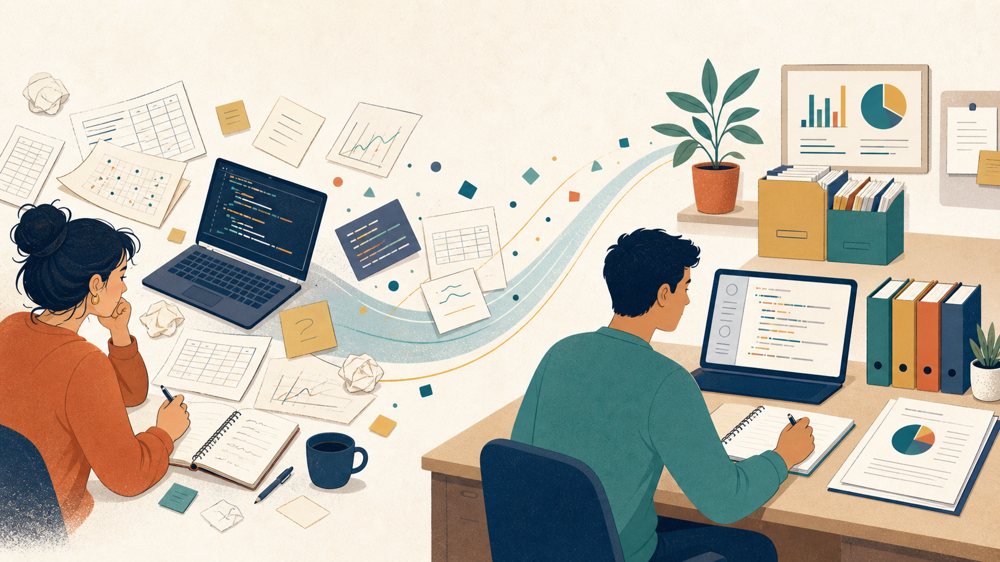
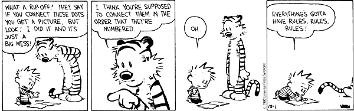
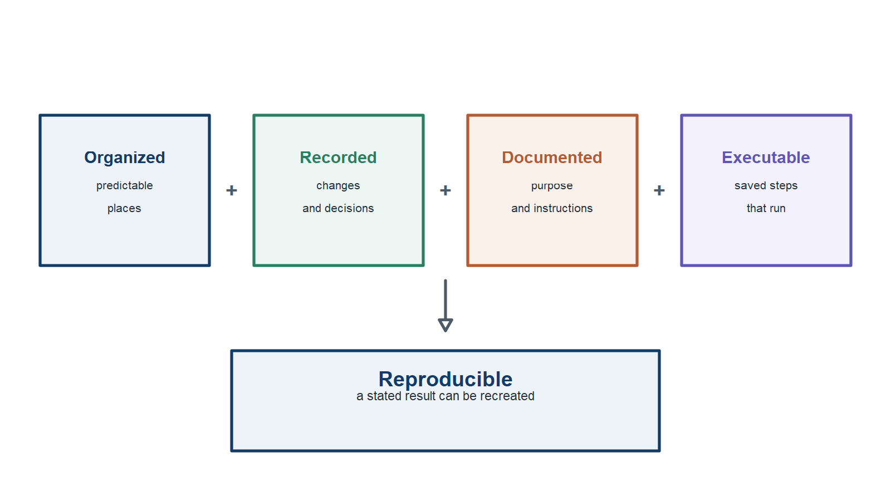
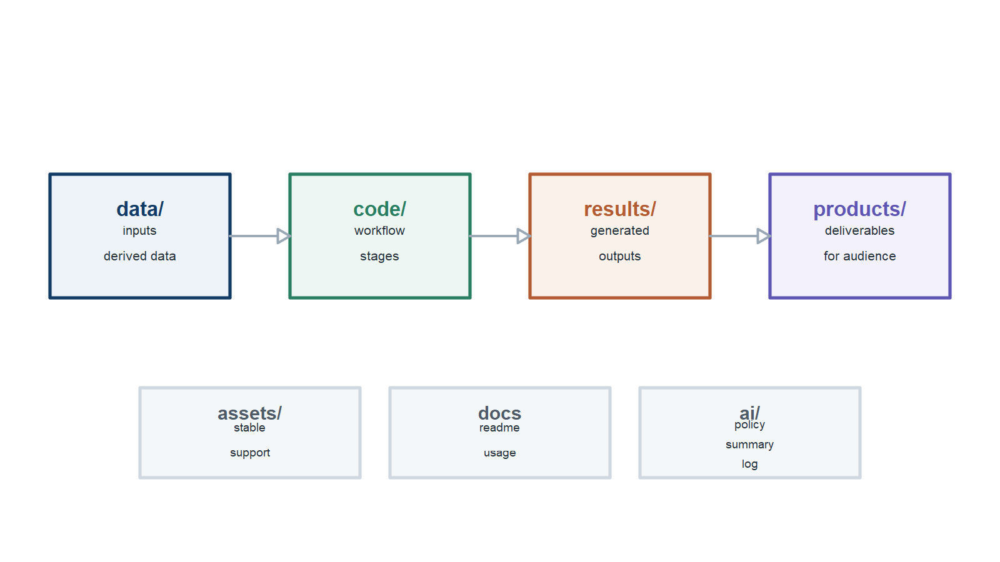
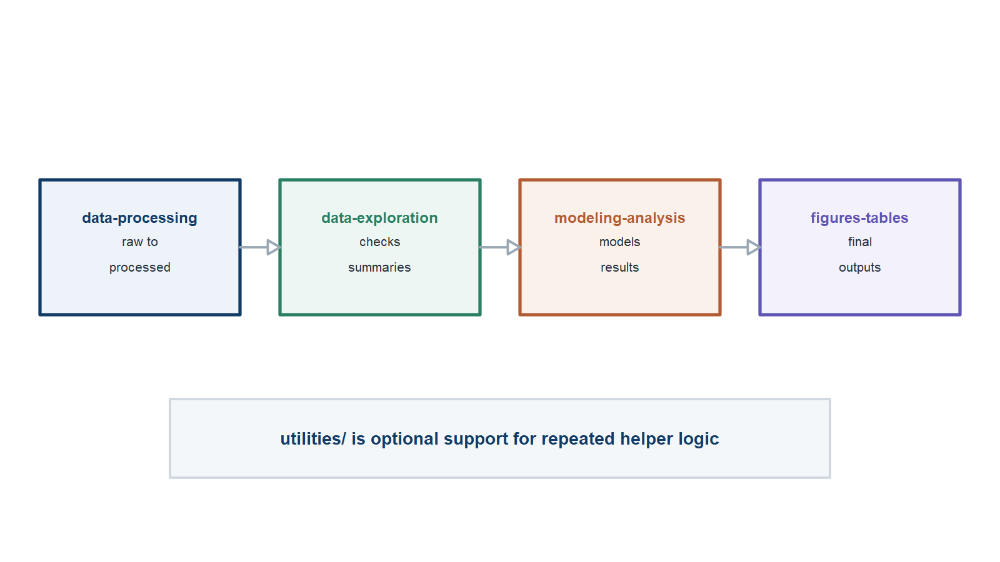

## Overview

::: {.arc-list}

01<strong>Concept</strong><small>Why organized, reproducible work matters—and how AI fits responsibly.</small>

02<strong>Implementation</strong><small>A practical project structure and workflow that make the work easier to continue.</small>

03<strong>Hands-on</strong><small>How to start from the template and adapt it to your own project.</small>

:::

## Concept {.section-break}

Part 1

A reproducible workflow is a better way to work now—not just a promise for later.

## Organized work makes science easier to sustain

::: {.split-layout .image-right}
::: {.copy-column}

A working habit, not a final audit

<strong>Reliable</strong>Important results can be regenerated and checked.

<strong>Efficient</strong>Updates start from code and documented inputs, not from memory.

<strong>Collaborative</strong>Others can find, review, and extend the work.

:::
::: {.visual-column}
{fig-alt="An illustration contrasting a cluttered desk with an organized digital research workspace."}
:::
:::

::: {.notes}
Open by framing reproducibility as everyday project hygiene. It reduces the friction of revisiting a result, sharing work, or making a small revision months later.

[Sources] Local template: readme.md; usage.md; code-guidelines.md.
:::

## Without structure, a project becomes harder to trust

::: {.split-layout .cartoon-right}
::: {.copy-column}
::: {.simple-list .compact-list}

<strong>Results drift from their code</strong>Copied tables and figures become hard to update or verify.

<strong>Files lose their roles</strong>Raw, processed, current, and obsolete versions blur together.

<strong>Decisions disappear</strong>Cleaning and modeling choices remain in private conversations or memory.

<strong>Sharing becomes risky</strong>Private data and unfinished material move into unsuitable places.

:::
:::
::: {.cartoon-column}
{fig-alt="A four-panel Calvin and Hobbes comic about rules."}

Rules should make the work easier, not harder.

:::
:::

::: {.notes}
The goal is not bureaucracy. The goal is just enough shared structure that files, decisions, and outputs remain understandable.

[Sources] Local template: readme.md; usage.md; agents.md. Cartoon: Bill Watterson, *Calvin and Hobbes*, October 1, 1991; from the presenter's local cartoon collection.
:::

## ORDERly names the essential habits

Organized + Recorded + Documented + Executable = Reproducible.

::: {.full-figure .framework-figure}
{fig-alt="A framework showing Organized, Recorded, Documented, and Executable as components of reproducible work."}
:::

::: {.notes}
Use the four words as a diagnostic. A project can be organized but poorly documented, or well documented but impossible to rerun. Reproducibility needs all four habits working together.

[Sources] ORDERly framework; local template: readme.md; usage.md.
:::

## AI assistance needs guardrails before it needs prompts

::: {.split-layout .image-right}
::: {.copy-column}

<strong>Organize</strong>Give the tool clear project context and bounded tasks.

<strong>Restrict</strong>Protect private, regulated, and otherwise sensitive material.

<strong>Document</strong>Record meaningful AI-supported changes and decisions.

<strong>Evaluate</strong>Check claims, code, outputs, and limitations before acceptance.

:::
::: {.visual-column}
{fig-alt="An illustration of a researcher reviewing AI-assisted work with a checklist."}
:::
:::

::: {.notes}
AI can speed up drafting, coding, and review. It does not remove the need to decide what may be shared, what claims are defensible, or whether a result is fit for use.

[Sources] Local template: ai/ai-use-policy.md; data/readme-data.md; agents.md.
:::

## Human judgment remains the gate

::: {.simple-list .spacious}

<strong>Science</strong>Are the data, model, assumptions, and interpretation appropriate?

<strong>Governance</strong>May these data, documents, and systems be used with this AI tool?

<strong>Acceptance</strong>Does the change work, and can the project owner explain and defend it?

:::

AI can support judgment; it cannot transfer accountability.

::: {.notes}
Never send private or restricted material to an AI tool unless that use is explicitly approved. The project owner remains responsible for the scientific and governance decisions.

[Sources] Local template: ai/ai-use-policy.md; data/readme-data.md; agents.md.
:::

## Implementation {.section-break}

Part 2

A template turns good intentions into a working environment.

Start with a small, legible structure. Add complexity only when the project needs it.

## The template gives every project component a home

::: {.split-layout .image-right}
::: {.copy-column}

<strong>Structure</strong>Folders distinguish code, data, results, products, and supporting assets.

<strong>Guidance</strong>Human-readable instructions explain how the pieces fit together.

<strong>Boundaries</strong>Rules protect raw data, private material, and generated outputs.

:::
::: {.visual-column}
{fig-alt="An illustration of an organized work kit containing protected data, code, analyses, documents, and AI tools."}
:::
:::

::: {.notes}
The template is a starting structure, not a rigid prescription. Its main job is to make the usual project decisions visible early.

[Sources] Local template: readme.md; usage.md; agents.md.
:::

## Tools serve the workflow—not the other way around

::: {.tool-rows}

<strong>Work environment</strong>Positron, VS Code, or RStudio

<strong>Analysis and authoring</strong>R, Python, Julia, Quarto, Typst, or comparable text-based tools

<strong>Versioning and collaboration</strong>Git, GitHub, and an approved AI coding assistant

:::

Choose tools that leave a readable, trackable record of what changed and why.

::: {.notes}
These examples are interchangeable. The important properties are transparent project files, reproducible execution, and a practical history of changes—not loyalty to a particular application.

[Sources] Local template: readme.md; usage.md; code-guidelines.md.
:::

## The repository structure gives each part a role

The main path moves through data, code, results, and products; support folders provide stable inputs and guidance.

::: {.full-figure .map-figure}
{fig-alt="A map of the project repository folders and their roles."}
:::

::: {.notes}
Walk through the main path first. Then add assets for supporting materials and ai for policy, context, guidance, and meaningful-use records.

[Sources] Local template: readme.md; usage.md.
:::

## Data status determines where it belongs

::: {.simple-list}

<strong>raw-data/</strong>Original input; preserve it unchanged.

<strong>processed-data/</strong>Cleaned or transformed data generated by code.

<strong>private-data/</strong>Restricted material kept in an approved location.

<strong>large-files/</strong>Material too large for ordinary Git and GitHub use.

:::

::: {.notes}
If raw data are inconvenient, write code that produces a processed version. The data README should document source, sensitivity, access limits, and AI inspection rules.

[Sources] Local template: data/readme-data.md; readme.md; usage.md; agents.md.
:::

## Code follows the stages of the analysis

Each stage should have recognizable inputs, outputs, and instructions.

::: {.full-figure .code-figure}
{fig-alt="The staged analysis-code folders: data processing, exploration, modeling and analysis, and figures and tables."}
:::

::: {.notes}
Processing creates processed data. Exploration checks it. Modeling and analysis compute results. Figures and tables prepare communication-ready artifacts. Utilities hold reusable helpers.

[Sources] Local template: usage.md; code/readme-code.md; code-guidelines.md.
:::

## Keep generated outputs separate from supporting inputs

::: {.simple-list}

<strong>results/</strong>Code-generated model objects, intermediate outputs, figures, and tables.

<strong>products/</strong>Reports, manuscripts, supplements, presentations, posters, and apps.

<strong>assets/</strong>References, PDFs, schematics, and other stable supporting material.

<strong>ai/</strong>AI policy, project context, guidance, and meaningful-use records.

:::

::: {.notes}
Do not place manually edited results in results. Put manually created supporting files in assets and document their source.

[Sources] Local template: readme.md; assets/readme-assets.md; ai/readme-ai.md; agents.md.
:::

## A staged workflow removes ambiguity

::: {.run-sequence}

1<strong>Process</strong><small>raw to processed</small>

2<strong>Explore</strong><small>checks and summaries</small>

3<strong>Analyze</strong><small>models and results</small>

4<strong>Prepare</strong><small>figures and tables</small>

5<strong>Render</strong><small>reports and slides</small>

:::

Regenerate results before updating the products that use them.

::: {.notes}
The example uses a documented, semi-automated workflow rather than one giant pipeline. Run affected scripts before rendering the product that consumes their outputs.

[Sources] Local template: usage.md; code/readme-code.md.
:::

## Check before accepting or sharing

::: {.simple-list}

<strong>Inputs</strong>Was raw data preserved and sensitive material kept in approved locations?

<strong>Traceability</strong>Can each important output be connected to code and documented inputs?

<strong>Execution</strong>Does the workflow run from a fresh session or clean copy?

<strong>Communication</strong>Do instructions, paths, figures, tables, and interpretations match?

:::

::: {.notes}
A clean run exposes hidden objects, absolute paths, missing packages, stale documentation, and manual steps. Compare outputs using criteria appropriate to the claim.

[Sources] Local template: usage.md; agents.md. ORDERly course: courses/orderly-workflows/reproducibility/reproducibility.qmd.
:::

## A useful project is easy to continue

::: {.closing-composition}

<strong>Current you</strong> can work efficiently.

<strong>Future you</strong> can recover the reasoning.

<strong>Collaborators</strong> can review and extend the work.

<strong>Others</strong> can understand and recreate the stated result.

:::

Make the workflow ORDERly. Let the template carry the structure.

::: {.notes}
Return to the opening. The template helps implement an understandable, recorded, documented, executable workflow. AI can accelerate it when assistance remains bounded and reviewable.

[Sources] Local template: readme.md; usage.md; ai/ai-use-policy.md. ORDERly course: courses/orderly-workflows/why-orderly/why-orderly.qmd.
:::

## Hands-on {.section-break}

Part 3

Start with the template. Then make it your project.

## Start with a small, complete workflow

::: {.split-layout .image-right}
::: {.copy-column}

<strong>1. Create a copy</strong>Start from the template repository rather than a blank folder.

<strong>2. Read the guidance</strong>Use the README and project instructions before reorganizing anything.

<strong>3. Adapt intentionally</strong>Rename, remove, or extend pieces only when the project needs them.

:::
::: {.visual-column}
{fig-alt="An illustration of a person following a path toward a reproducible research workspace."}
:::
:::

::: {.notes}
Start with the structure, then tailor it. The template is deliberately lightweight; it gives a new project a clear first path without forcing an advanced workflow.

[Sources] Template repository: https://github.com/andreashandel/mds-project-template; local template: new-project-instructions.md; usage.md.
:::

## In your first session, make the project legible

::: {.steps-list}

1
<strong>Define the project</strong> Update the README and basic project metadata.

2
<strong>Describe the data</strong> Record source, sensitivity, access, and AI-use boundaries.

3
<strong>Map the workflow</strong> Decide what code produces each important result and product.

4
<strong>Set review points</strong> Decide what needs human checking before it is accepted or shared.

:::

::: {.notes}
You do not need all analytic decisions on day one. You do need enough context that a collaborator—or future you—can understand the starting point.

[Sources] Local template: new-project-instructions.md; data/readme-data.md; ai/ai-use-policy.md; usage.md.
:::

## Add complexity only when it earns its place

::: {.simple-list .compact-list}

<strong>More packages</strong>Use a package manager such as renv when exact versions materially affect a longer-lived project.

<strong>More automation</strong>Add targets, containers, or continuous integration when repeated workflows and collaboration justify them.

<strong>More documentation</strong>Extend project guidance when new data, collaborators, or governance constraints make it necessary.

:::

::: {.notes}
The template’s default is deliberately lightweight. Add dependency management and automation because they solve an identified problem, not because they are fashionable.

[Sources] Local template: agents.md; readme.md; usage.md.
:::

## Continue learning

::: {.resource-list}

<strong>MDS tools mini-courses</strong><a href="https://andreashandel.github.io/mds-tools/">andreashandel.github.io/mds-tools/</a>

<strong>Inside the template</strong><code>readme.md</code> · <code>usage.md</code> · <code>new-project-instructions.md</code>

<strong>Next step</strong>Create a project copy, read the guidance, and make one small change you can trace from input to product.

:::

::: {.notes}
Close with a concrete next step: use the template for one small project or one well-defined piece of a larger project. Learn the structure by using it.

[Sources] Template repository: https://github.com/andreashandel/mds-project-template; MDS tools mini-courses: https://andreashandel.github.io/mds-tools/.
:::
